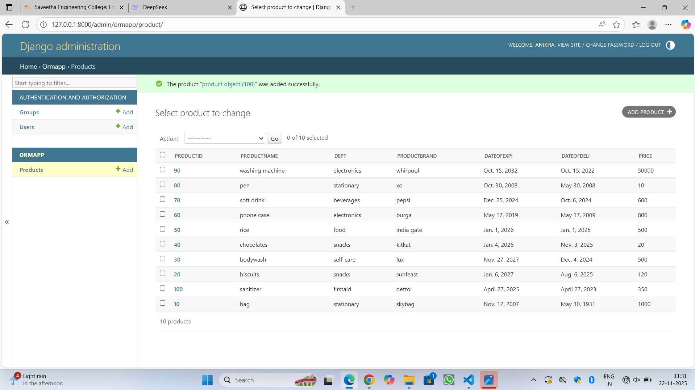

# Ex01 Django ORM Web Application
## Date: 22-11-2025

## AIM
To develop a Django Application to store and retrieve data from a E-Commerce Website Database for Amazon or Flipkart using Object Relational Mapping(ORM).


## DESIGN STEPS

### STEP 1:
Clone the problem from GitHub

### STEP 2:
Create a new app in Django project

### STEP 3:
Enter the code for admin.py and models.py

### STEP 4:
Detect changes and create migration files that describe how to modify the database schema

### STEP 5:
Execute the migration files and update the database schema to match your Django models

### STEP 6:
Create a superuser with full access rights to all models and data through the admin interface.

### STEP 7:
Apply the migration files of the created app to the database

### STEP 8:
Execute Django admin using localhost and create details for 10 entries

## PROGRAM
```
from django.db import models
from django.contrib import admin
class product(models.Model):
    productID=models.CharField(primary_key=True,max_length=7)
    productname=models.CharField(max_length=30)
    dept=models.CharField(max_length=20)
    productbrand=models.CharField(max_length=20)
    Dateofexpi=models.DateField()
    Dateofdeli=models.DateField()
    price=models.IntegerField()

class productAdmin(admin.ModelAdmin):
    list_display=["productID","productname","dept","productbrand","Dateofexpi","Dateofdeli","price"]

admin.py

from django.contrib import admin
from .models import product,productAdmin
admin.site.register(product,productAdmin)
```


## OUTPUT



## RESULT
Thus the program for creating E-commerce website database using ORM hass been executed successfully
